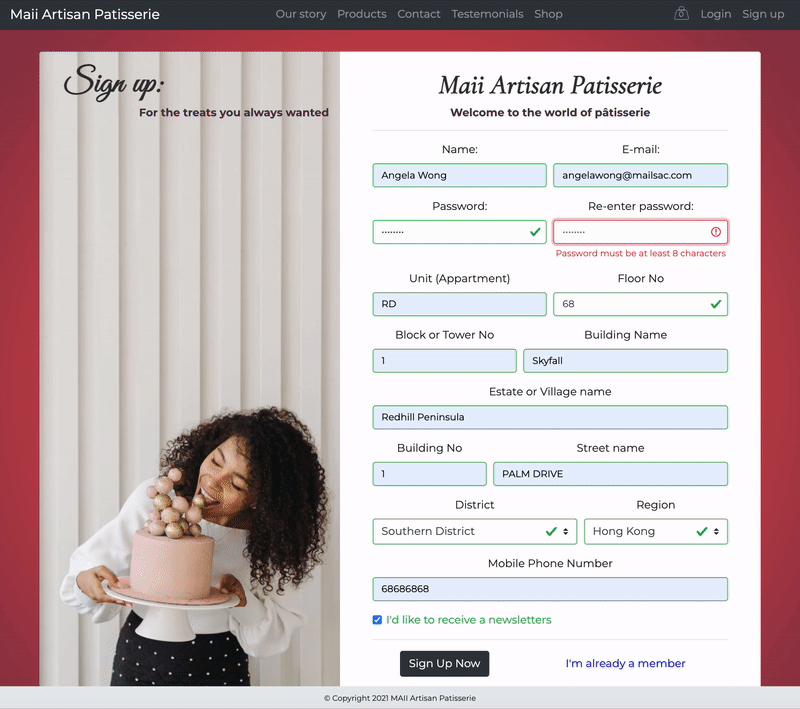

<h1 align="center">
<br>
  <a href="https://patisserie-artisanale.herokuapp.com/"></a>
  <br>
  Maii Artisan Patisserie

  <br>
</h1>

 <p align="center">
   <a href="#deployed-version">Demo</a> •
   <a href="#description">Description</a> •
   <a href="#key-features">Key Features</a> •
   <a href="#demonstration">Demonstration</a> •
   <a href="#technologies-used">Technologies Used</a> •
   <a href="#getting-started">Getting Started</a> •
  <a href="#deployment">Deployment</a> •
    <a href="#restful-api">RESTful API</a> •
   <a href="#error-handling">Error Handling</a>

</p>

## Deployed Version

For live demo please visit 👉 https://patisserie-artisanale.herokuapp.com/

## Description

Maii Artisan Patisserie is a full stack web application for a bakery/cake shop. Is has backend RESTful API and server-side rendering for a website.

## Key Features

- Shopping Cart
  - Add, remove, adjust quantity, select custom options for the items
  - Shopping cart information is saved as session data in a DB and retrived by cookie on subsequent visits
- Checkout
  - Choose a day and address for delivery, add a new shipping address
  - Checkout with Stripe payment proccessor
- Front page
  - Fully resposive and modern design
  - Contact Us form that uses backend NodeMailer
- User Account
  - Allow user to change they name, e-mail, profile photo and password
  - Add/edit Shipping addresses
  - Display placed orders with detailed information about ordered Items and order status.
- Admin Account
  - Display all orders with ability to filter them, change order status.
  - Display all products, edit products
  - Edit settings for custom options available for users during ordering (custom flavors,custom colors,special request options, inscription Text length)
- Security
  - Authentication with JWT
  - Authorization ( user and admin roles)
  - Password encryption with [Crypto](https://github.com/brix/crypto-js)
  - Data sanitization, rate limiting.

## Demonstration

#### Home Page :


#### Signup:



#### Add to Cart & Checkout:


#### Signin & User Profile - Edit settings :


#### User Profile - View my orders :


#### Admin Profile - View & edit products :


#### Admin Profile - View & process orders :


#### Admin Profile - Edit settings :


## Technologies Used

- JavaScript
- [Node.js](https://nodejs.org/) / [Express.js](https://expressjs.com/)
- HTML / [SASS](https://sass-lang.com/)
- [Mongoose](https://mongoosejs.com/)
- [axios](https://www.npmjs.com/package/axios)
- [MongoDB Atlas](https://www.mongodb.com/cloud/atlas)
- [JSON Web Token](https://jwt.io/)
- [ParcelJS](https://parceljs.org/)
- [Stripe](https://stripe.com/)
- [Postman](https://www.getpostman.com/)
- [Mailtrap](https://mailtrap.io/)
- [Sendgrid](https://sendgrid.com/)
- [Ejs](https://ejs.co/)
- [jQuery](https://jquery.com)
- [Bootstrap](https://getbootstrap.com/)
- [Pixi](https://pixijs.com/)
- [Smart Html Elements](https://www.htmlelements.com/)
- [Heroku](https://www.heroku.com/)
- [Parcel](https://parceljs.org/)

## Getting Started

### Prerequisites

Make sure Node and npm are installed from the terminal

```bash
$ node -v
$ npm -v
```

---

### Installation

1. Fork this repo, then clone the app down to your computer:

   ```bash
   $ git clone  https://github.com/hkzone/MaiiArtisan.git
   ```

2. `cd` into your new folder and install all the
   dependencies by running:

   ```bash
   $ npm i
   ```

3. Sign up for API keys with:

- [MongoDB Atlas](https://www.mongodb.com/cloud/atlas)
- [Stripe](https://stripe.com/)
- [Mailtrap](https://mailtrap.io/)
- [Sendgrid](https://sendgrid.com/)
  <br>

4. Configure environment variables by creating new `config.env` file in the root of your project. Fill the file with variables as bellow:

   ```bash
   NODE_ENV = development
   PORT = 3000
   DATABASE = *****************************
   DATABASE_PASSWORD = ********************
   JWT_SECRET = ***************************
   JWT_EXPIRES_IN = 90d
   JWT_COOKIE_EXPIRES_IN = 90
   EMAIL_USERNAME = ***********************
   EMAIL_PASSWORD = ***********************
   EMAIL_HOST = smtp.mailtrap.io
   EMAIL_PORT = ***************************
   EMAIL_FROM = '**************************'
   SENDGRID_USERNAME = ********************
   SENDGRID_PASSWORD = ********************
   STRIPE_SECRET_KEY = ********************
   STRIPE_WEBHOOK_SECRET = ****************
   NAME = '********************************'
   DATABASE_SESSIONS = 'sessions'
   SESSIONS_SECRET = '*********************'
   LOCALE_LANG = 'en-US'
   LOCALE_CURRENCY = '*********************'


   ```

5. Run the app in development mode at http://localhost:3000/

   |       Command        |            Action            |
   | :------------------: | :--------------------------: |
   |  `npm run build:js`  |        Build project         |
   |     `npm start`      |         Run project          |
   |    `npm run dev`     |           Run dev            |
   |  `npm run watch:js`  | Auto rebuild project for dev |
   | `npm run start:prod` |  Run project in production   |

---

## Deployment

The website is deployed with git into heroku. Below are the steps taken:

1. Build the project

```
$ npm run build:js
```

2. Initialize and commit the project

```
$ git init
$ git add -A
$ git commit -m "Commit message"
```

3. Login to heroku, create a new app, and initialize every variable from `config.env` file and deploy

```
$ heroku login
$ heroku create
$ heroku config:set CONFIG_KEY=CONFIG_VALUE
$ git push heroku master
```

---

## RESTful API

This web application uses the RESTful API with advanced features: filtering, sorting, pagination, etc.

### API Documentation

Check [Maii Artisan Patisserie API Documentation
](https://documenter.getpostman.com/view/16017496/UVsFx7r8) for more info.

### API Usage

Before using the API, you need to set the variables in Postman depending on your environment (development or production). Simply add:

```
- {{URL}} with your hostname as a value (Eg. http://127.0.0.1:3000 or http://www.myhost.com)
- {{password}} with your user password as a value.
```

### API Example:

Products list: https://patisserie-artisanale.herokuapp.com/api/v1/products

---

## Error handling

- Error handling is implemented for development and production mode with a notification about an error.
- User will be informed about uncomplete data.
